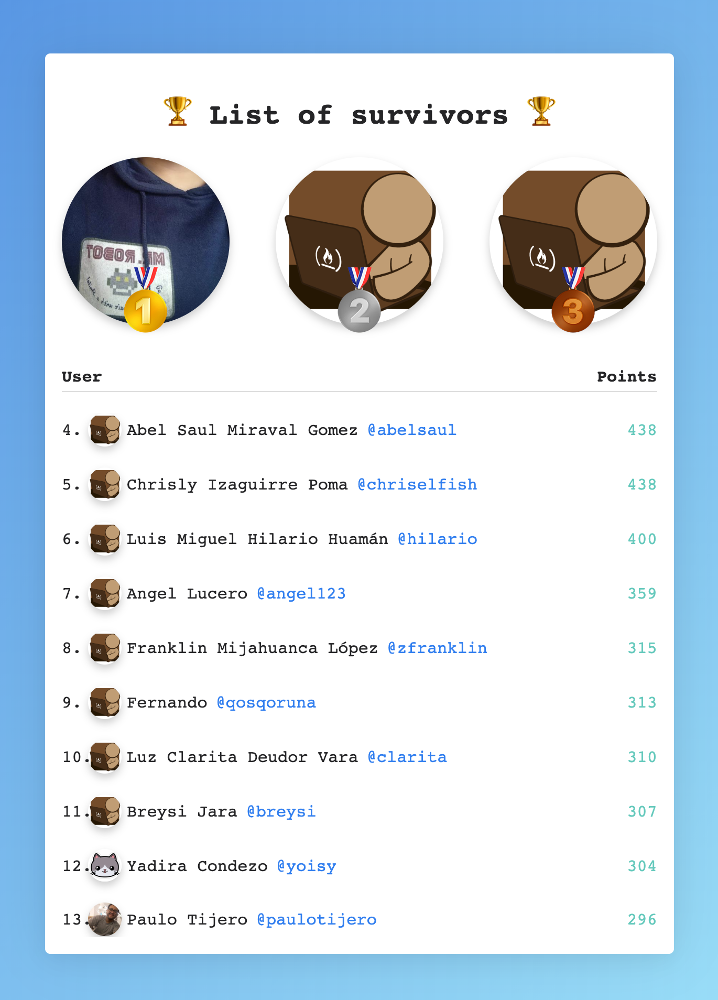

# Simple app with Webscraping 🔓

This is an example application that shows how to use Webscraping with puppeter in Node.

This app is used to motivate the study group of freecodecamp(Tingo María).

## Demo

Demo available [here](https://space-fcc-leaderboard.now.sh/).

## Setup

To start this application locally:

1. Make sure you have installed _Node_ and _Yarn_
2. Clone repositorie: `git clone https://github.com/condef5/freecodecamp-scraping`
3. Move into directory: `cd freecodecamp-scraping`
4. Install the Node packages `$ yarn install`
5. Start the web development server: `$ yarn dev`
6. Go to the [http://localhost:3000/](http://localhost:3000/)
